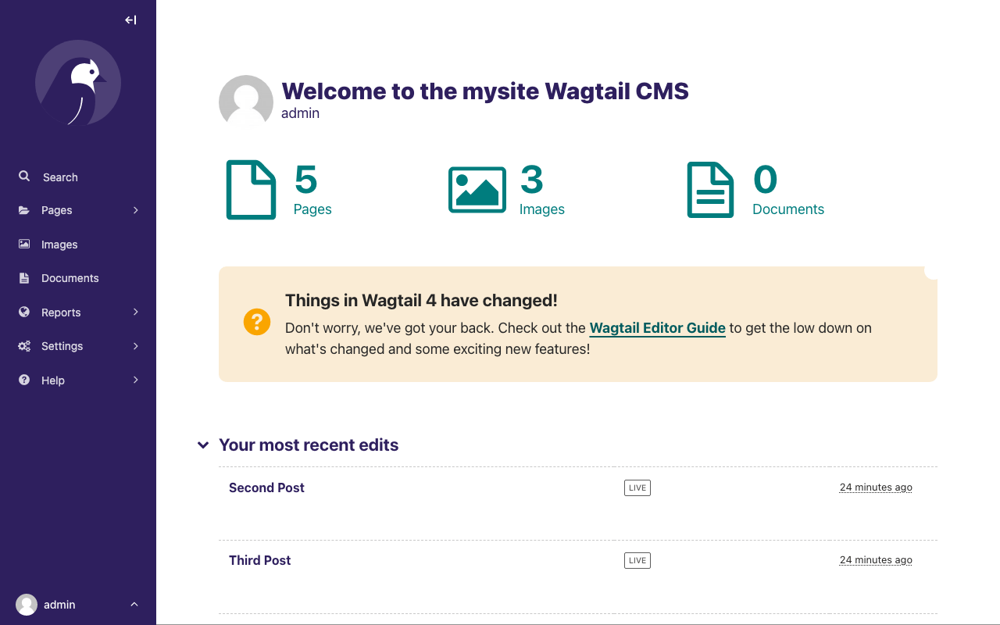
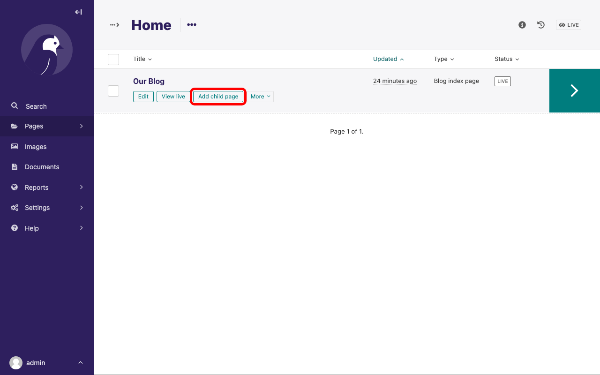
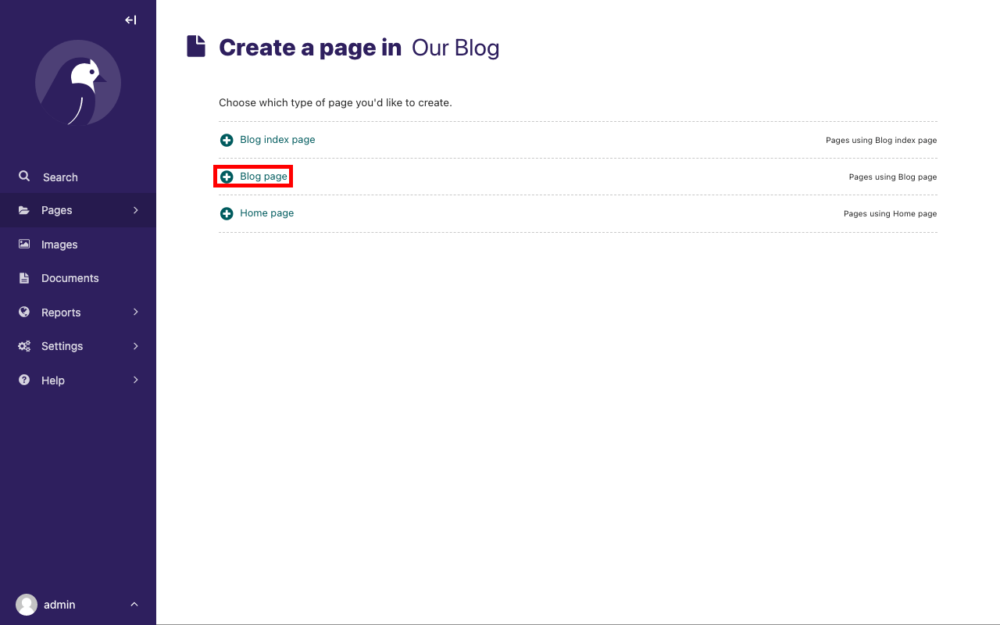
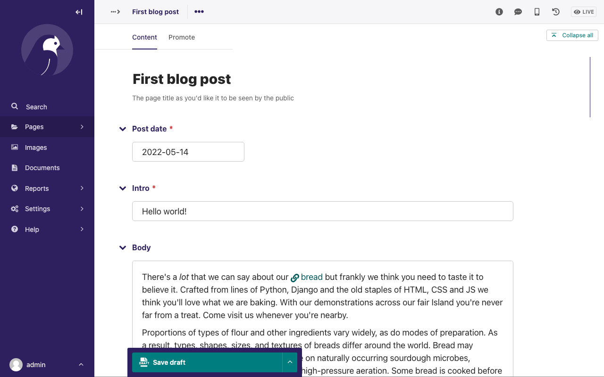
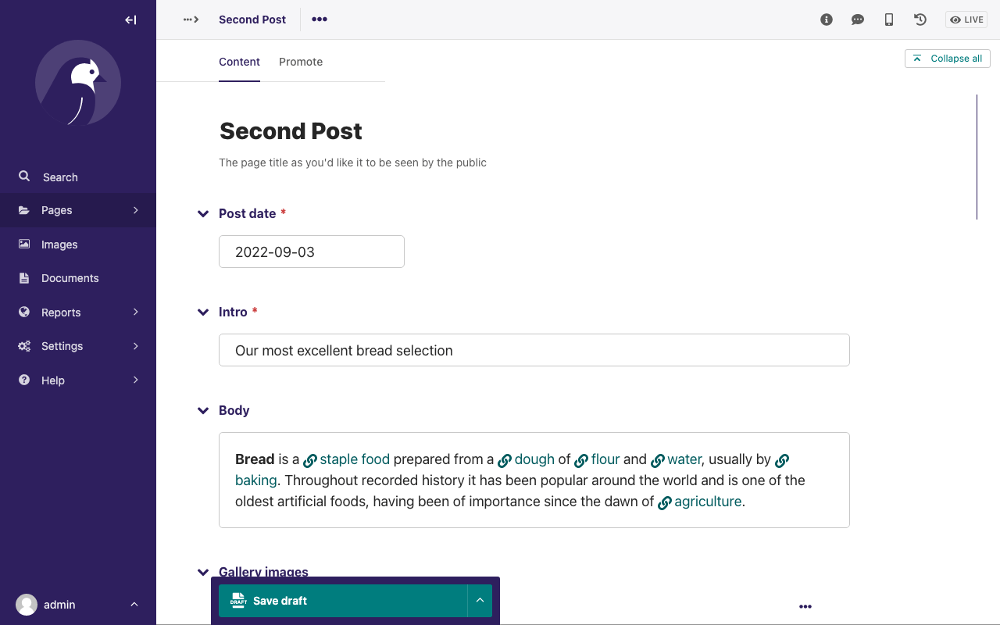
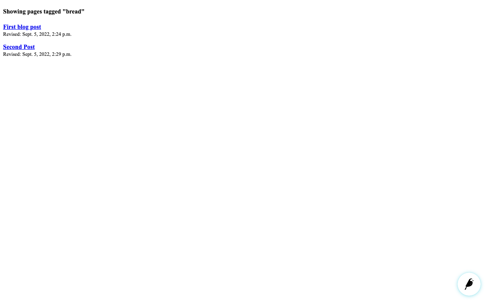

# Your first Wagtail site

```eval_rst
.. note::
   This tutorial covers setting up a brand new Wagtail project.
   If you'd like to add Wagtail to an existing Django project instead, see :doc:`integrating_into_django`.
```

## Install and run Wagtail

### Install dependencies

Wagtail supports Python 3.7, 3.8, 3.9 and 3.10.

To check whether you have an appropriate version of Python 3:

```console
$ python3 --version
```

If this does not return a version number or returns a version lower than 3.7, you will need to [install Python 3](https://www.python.org/downloads/).

```eval_rst
.. important::
   Before installing Wagtail, it is necessary to install the **libjpeg** and **zlib** libraries, which provide support for working with JPEG, PNG and GIF images (via the Python **Pillow** library).
   The way to do this varies by platform—see Pillow's
   `platform-specific installation instructions <https://pillow.readthedocs.org/en/latest/installation.html#external-libraries>`_.
```

### Create and activate a virtual environment

We recommend using a virtual environment, which isolates installed dependencies from other projects.
This tutorial uses [`venv`](https://docs.python.org/3/tutorial/venv.html), which is packaged with Python 3.

**On Windows** (cmd.exe):

```doscon
> python3 -m venv mysite\env
> mysite\env\Scripts\activate.bat
```

**On GNU/Linux or MacOS** (bash):

```console
$ python3 -m venv mysite/env
$ source mysite/env/bin/activate
```

**For other shells** see the [`venv` documentation](https://docs.python.org/3/library/venv.html).

```eval_rst
.. note::

   If you're using version control (e.g. git), ``mysite`` will be the directory for your project.
   The ``env`` directory inside of it should be excluded from any version control.
```

### Install Wagtail

Use pip, which is packaged with Python, to install Wagtail and its dependencies:

```console
$ pip install wagtail
```

### Generate your site

Wagtail provides a `start` command similar to `django-admin startproject`.
Running `wagtail start mysite` in your project will generate a new `mysite` folder with a few Wagtail-specific extras, including
the required project settings,
a "home" app with a blank `HomePage` model and basic templates,
and a sample "search" app.

Because the folder `mysite` was already created by `venv`, run `wagtail start` with an additional argument to specify the destination directory:

```console
$ wagtail start mysite mysite
```

```eval_rst
.. note::

   Generally, in Wagtail, each page type, or content type, is represented by a single app. However, different apps can be aware of each other and   access each other's data. All of the apps need to be registered within the ``INSTALLED_APPS`` section of the ``settings`` file. Look at this file to see how the ``start`` command has listed them in there.
```

### Install project dependencies

```console
$ cd mysite
$ pip install -r requirements.txt
```

This ensures that you have the relevant versions of
Wagtail,
Django,
and any other dependencies for the project you have just created.

### Create the database

If you haven't updated the project settings, this will be a SQLite database file in the project directory.

```console
$ python manage.py migrate
```

This command ensures that the tables in your database are matched to the models in your project. Every time you alter your model (eg. you may add a field to a model) you will need to run this command in order to update the database.

### Create an admin user

```console
$ python manage.py createsuperuser
```

When logged into the admin site, a superuser has full permissions and is able to view/create/manage the database.

### Start the server

```console
$ python manage.py runserver
```

If everything worked, <http://127.0.0.1:8000> will show you a welcome page:


You can now access the administrative area at <http://127.0.0.1:8000/admin>



## Extend the HomePage model

Out of the box, the "home" app defines a blank `HomePage` model in `models.py`, along with a migration that creates a homepage and configures Wagtail to use it.

Edit `home/models.py` as follows, to add a `body` field to the model:

```python
from django.db import models

from wagtail.core.models import Page
from wagtail.core.fields import RichTextField
from wagtail.admin.edit_handlers import FieldPanel


class HomePage(Page):
    body = RichTextField(blank=True)

    content_panels = Page.content_panels + [
        FieldPanel('body', classname="full"),
    ]
```

`body` is defined as `RichTextField`, a special Wagtail field. When `blank=True`,
it means that this field is not required and can be empty. You
can use any of the [Django core fields](https://docs.djangoproject.com/en/stable/ref/models/fields). `content_panels` define the
capabilities and the layout of the editing interface. When you add fields to `content_panels`, it enables them to be edited on the Wagtail interface. [More on creating Page models](../topics/pages).

Run `python manage.py makemigrations` (this will create the migrations file), then
`python manage.py migrate` (this executes the migrations and updates the database with your model
changes). You must run the above commands each time you make changes to
the model definition.

You can now edit the homepage within the Wagtail admin area (go to Pages, Homepage, then Edit) to see the new body field. Enter some text into the body field, and publish
the page by selecting *Publish* at the bottom of the page editor, rather than *Save Draft*.

The page template now needs to be updated to reflect the changes made
to the model. Wagtail uses normal Django templates to render each page
type. By default, it will look for a template filename formed from the app and model name,
separating capital letters with underscores (e.g. HomePage within the 'home' app becomes
`home/home_page.html`). This template file can exist in any location recognised by
[Django's template rules](https://docs.djangoproject.com/en/stable/intro/tutorial03/#write-views-that-actually-do-something); conventionally it is placed under a `templates` folder within the app.

Edit `home/templates/home/home_page.html` to contain the following:

```html+django




template-homepage


    {{ page.body|richtext }}

```

`base.html` refers to a parent template and must always be the first template tag used in a template. Extending from this template saves you from rewriting code and allows pages across your app to share a similar frame (by using block tags in the child template, you are able to override specific content within the parent template).

`wagtailcore_tags` must also be loaded at the top of the template and provide additional tags to those provided by Django.


### Wagtail template tags

In addition to Django's [template tags and filters](https://docs.djangoproject.com/en/3.1/ref/templates/builtins/),
Wagtail provides a number of its own [template tags & filters](template-tags-and-filters)
which can be loaded by including `` at the top of
your template file.

In this tutorial, we use the _richtext_ filter to escape and print the contents
of a `RichTextField`:

```html+django

{{ page.body|richtext }}
```

Produces:

```html
<p>
    <b>Welcome</b> to our new site!
</p>
```

**Note:** You'll need to include `` in each
template that uses Wagtail's tags. Django will throw a `TemplateSyntaxError`
if the tags aren't loaded.

## A basic blog

We are now ready to create a blog. To do so, run
`python manage.py startapp blog` to create a new app in your Wagtail site.

Add the new `blog` app to `INSTALLED_APPS` in `mysite/settings/base.py`.

### Blog Index and Posts

Lets start with a simple index page for our blog. In `blog/models.py`:

```python
from wagtail.core.models import Page
from wagtail.core.fields import RichTextField
from wagtail.admin.edit_handlers import FieldPanel


class BlogIndexPage(Page):
    intro = RichTextField(blank=True)

    content_panels = Page.content_panels + [
        FieldPanel('intro', classname="full")
    ]
```

Run `python manage.py makemigrations` and `python manage.py migrate`.

Since the model is called `BlogIndexPage`, the default template name
(unless we override it) will be `blog/templates/blog/blog_index_page.html`. Create this file
with the following content:

```html+django




template-blogindexpage


    <h1>{{ page.title }}</h1>

    <div class="intro">{{ page.intro|richtext }}</div>

    
        <h2><a href="">{{ post.title }}</a></h2>
        {{ post.specific.intro }}
        {{ post.specific.body|richtext }}
    


```

Most of this should be familiar, but we'll explain `get_children` a bit later.
Note the `pageurl` tag, which is similar to Django's `url` tag but
takes a Wagtail Page object as an argument.

In the Wagtail admin, create a `BlogIndexPage` as a child of the Homepage,
make sure it has the slug "blog" on the Promote tab, and publish it.
You should now be able to access the url `/blog` on your site
(note how the slug from the Promote tab defines the page URL).

Now we need a model and template for our blog posts. In `blog/models.py`:

```python
from django.db import models

from wagtail.core.models import Page
from wagtail.core.fields import RichTextField
from wagtail.admin.edit_handlers import FieldPanel
from wagtail.search import index


# Keep the definition of BlogIndexPage, and add:


class BlogPage(Page):
    date = models.DateField("Post date")
    intro = models.CharField(max_length=250)
    body = RichTextField(blank=True)

    search_fields = Page.search_fields + [
        index.SearchField('intro'),
        index.SearchField('body'),
    ]

    content_panels = Page.content_panels + [
        FieldPanel('date'),
        FieldPanel('intro'),
        FieldPanel('body', classname="full"),
    ]
```

In the model above, we import `index` as this makes the model searchable. You can then list fields that you want to be searchable for the user.

Run `python manage.py makemigrations` and `python manage.py migrate`.

Create a template at `blog/templates/blog/blog_page.html`:

```html+django




template-blogpage


    <h1>{{ page.title }}</h1>
    <p class="meta">{{ page.date }}</p>

    <div class="intro">{{ page.intro }}</div>

    {{ page.body|richtext }}

    <p><a href="{{ page.get_parent.url }}">Return to blog</a></p>


```

Note the use of Wagtail's built-in `get_parent()` method to obtain the
URL of the blog this post is a part of.

Now create a few blog posts as children of `BlogIndexPage`.
Be sure to select type "Blog Page" when creating your posts.





Wagtail gives you full control over what kinds of content can be created under
various parent content types. By default, any page type can be a child of any
other page type.



Publish each blog post when you are done editing.

You should now have the very beginnings of a working blog.
Access the `/blog` URL and you should see something like this:


Titles should link to post pages, and a link back to the blog's
homepage should appear in the footer of each post page.

### Parents and Children

Much of the work you'll be doing in Wagtail revolves around the concept of hierarchical
"tree" structures consisting of nodes and leaves (see [Theory](../reference/pages/theory)).
In this case, the `BlogIndexPage` is a "node" and individual `BlogPage` instances
are the "leaves".

Take another look at the guts of `blog_index_page.html`:

```html+django

    <h2><a href="">{{ post.title }}</a></h2>
    {{ post.specific.intro }}
    {{ post.specific.body|richtext }}

```

Every "page" in Wagtail can call out to its parent or children
from its own position in the hierarchy. But why do we have to
specify `post.specific.intro` rather than `post.intro`?
This has to do with the way we defined our model:

`class BlogPage(Page):`

The `get_children()` method gets us a list of instances of the `Page` base class.
When we want to reference properties of the instances that inherit from the base class,
Wagtail provides the `specific` method that retrieves the actual `BlogPage` record.
While the "title" field is present on the base `Page` model, "intro" is only present
on the `BlogPage` model, so we need `.specific` to access it.

To tighten up template code like this, we could use Django's `with` tag:

```html+django

    
        <h2><a href="">{{ post.title }}</a></h2>
        <p>{{ post.intro }}</p>
        {{ post.body|richtext }}
    

```

When you start writing more customized Wagtail code, you'll find a whole set of QuerySet
modifiers to help you navigate the hierarchy.

```python
# Given a page object 'somepage':
MyModel.objects.descendant_of(somepage)
child_of(page) / not_child_of(somepage)
ancestor_of(somepage) / not_ancestor_of(somepage)
parent_of(somepage) / not_parent_of(somepage)
sibling_of(somepage) / not_sibling_of(somepage)
# ... and ...
somepage.get_children()
somepage.get_ancestors()
somepage.get_descendants()
somepage.get_siblings()
```

For more information, see: [Page QuerySet reference](../reference/pages/queryset_reference)

### Overriding Context

There are a couple of problems with our blog index view:

1)  Blogs generally display content in *reverse* chronological order
2)  We want to make sure we're only displaying *published* content.

To accomplish these things, we need to do more than just grab the index
page's children in the template. Instead, we'll want to modify the
QuerySet in the model definition. Wagtail makes this possible via
the overridable `get_context()` method. Modify your `BlogIndexPage`
model like this:

```python
class BlogIndexPage(Page):
    intro = RichTextField(blank=True)

    def get_context(self, request):
        # Update context to include only published posts, ordered by reverse-chron
        context = super().get_context(request)
        blogpages = self.get_children().live().order_by('-first_published_at')
        context['blogpages'] = blogpages
        return context
```

All we've done here is retrieve the original context, create a custom QuerySet,
add it to the retrieved context, and return the modified context back to the view.
You'll also need to modify your `blog_index_page.html` template slightly.
Change:

`` to ``

Now try unpublishing one of your posts - it should disappear from the blog index
page. The remaining posts should now be sorted with the most recently published
posts first.

### Images

Let's add the ability to attach an image gallery to our blog posts. While it's possible to simply insert images into the `body` rich text field, there are several advantages to setting up our gallery images as a new dedicated object type within the database - this way, you have full control of the layout and styling of the images on the template, rather than having to lay them out in a particular way within the rich text field. It also makes it possible for the images to be used elsewhere, independently of the blog text - for example, displaying a thumbnail on the blog index page.

Add a new `BlogPageGalleryImage` model to `models.py`:

```python
from django.db import models

# New imports added for ParentalKey, Orderable, InlinePanel

from modelcluster.fields import ParentalKey

from wagtail.core.models import Page, Orderable
from wagtail.core.fields import RichTextField
from wagtail.admin.edit_handlers import FieldPanel, InlinePanel
from wagtail.search import index


# ... (Keep the definition of BlogIndexPage, and update BlogPage:)


class BlogPage(Page):
    date = models.DateField("Post date")
    intro = models.CharField(max_length=250)
    body = RichTextField(blank=True)

    search_fields = Page.search_fields + [
        index.SearchField('intro'),
        index.SearchField('body'),
    ]

    content_panels = Page.content_panels + [
        FieldPanel('date'),
        FieldPanel('intro'),
        FieldPanel('body', classname="full"),
        InlinePanel('gallery_images', label="Gallery images"),
    ]


class BlogPageGalleryImage(Orderable):
    page = ParentalKey(BlogPage, on_delete=models.CASCADE, related_name='gallery_images')
    image = models.ForeignKey(
        'wagtailimages.Image', on_delete=models.CASCADE, related_name='+'
    )
    caption = models.CharField(blank=True, max_length=250)

    panels = [
        FieldPanel('image'),
        FieldPanel('caption'),
    ]
```

Run `python manage.py makemigrations` and `python manage.py migrate`.

There are a few new concepts here, so let's take them one at a time:

Inheriting from `Orderable` adds a `sort_order` field to the model, to keep track of the ordering of images in the gallery.

The `ParentalKey` to `BlogPage` is what attaches the gallery images to a specific page. A `ParentalKey` works similarly to a `ForeignKey`, but also defines `BlogPageGalleryImage` as a "child" of the `BlogPage` model, so that it's treated as a fundamental part of the page in operations like submitting for moderation, and tracking revision history.

`image` is a `ForeignKey` to Wagtail's built-in `Image` model, where the images themselves are stored. This appears in the page editor as a pop-up interface for choosing an existing image or uploading a new one. This way, we allow an image to exist in multiple galleries - effectively, we've created a many-to-many relationship between pages and images.

Specifying `on_delete=models.CASCADE` on the foreign key means that if the image is deleted from the system, the gallery entry is deleted as well. (In other situations, it might be appropriate to leave the entry in place - for example, if an "our staff" page included a list of people with headshots, and one of those photos was deleted, we'd rather leave the person in place on the page without a photo. In this case, we'd set the foreign key to `blank=True, null=True, on_delete=models.SET_NULL`.)

Finally, adding the `InlinePanel` to `BlogPage.content_panels` makes the gallery images available on the editing interface for `BlogPage`.

Adjust your blog page template to include the images:

```html+django




template-blogpage


    <h1>{{ page.title }}</h1>
    <p class="meta">{{ page.date }}</p>

    <div class="intro">{{ page.intro }}</div>

    {{ page.body|richtext }}

    
        <div style="float: left; margin: 10px">
            
            <p>{{ item.caption }}</p>
        </div>
    

    <p><a href="{{ page.get_parent.url }}">Return to blog</a></p>


```

Here we use the `` tag (which exists in the `wagtailimages_tags` library, imported at the top of the template) to insert an `` element, with a `fill-320x240` parameter to indicate that the image should be resized and cropped to fill a 320x240 rectangle. You can read more about using images in templates in the [docs](../topics/images).


Since our gallery images are database objects in their own right, we can now query and re-use them independently of the blog post body. Let's define a `main_image` method, which returns the image from the first gallery item (or `None` if no gallery items exist):

```python
class BlogPage(Page):
    date = models.DateField("Post date")
    intro = models.CharField(max_length=250)
    body = RichTextField(blank=True)

    def main_image(self):
        gallery_item = self.gallery_images.first()
        if gallery_item:
            return gallery_item.image
        else:
            return None

    search_fields = Page.search_fields + [
        index.SearchField('intro'),
        index.SearchField('body'),
    ]

    content_panels = Page.content_panels + [
        FieldPanel('date'),
        FieldPanel('intro'),
        FieldPanel('body', classname="full"),
        InlinePanel('gallery_images', label="Gallery images"),
    ]
```

This method is now available from our templates. Update `blog_index_page.html` to include the main image as a thumbnail alongside each post:

```html+django


...


    
        <h2><a href="">{{ post.title }}</a></h2>

        
            
        

        <p>{{ post.intro }}</p>
        {{ post.body|richtext }}
    

```

### Tagging Posts

Let's say we want to let editors "tag" their posts, so that readers can, e.g.,
view all bicycle-related content together. For this, we'll need to invoke
the tagging system bundled with Wagtail, attach it to the `BlogPage`
model and content panels, and render linked tags on the blog post template.
Of course, we'll need a working tag-specific URL view as well.

First, alter `models.py` once more:

```python
from django.db import models

# New imports added for ClusterTaggableManager, TaggedItemBase, MultiFieldPanel

from modelcluster.fields import ParentalKey
from modelcluster.contrib.taggit import ClusterTaggableManager
from taggit.models import TaggedItemBase

from wagtail.core.models import Page, Orderable
from wagtail.core.fields import RichTextField
from wagtail.admin.edit_handlers import FieldPanel, InlinePanel, MultiFieldPanel
from wagtail.search import index


# ... (Keep the definition of BlogIndexPage)


class BlogPageTag(TaggedItemBase):
    content_object = ParentalKey(
        'BlogPage',
        related_name='tagged_items',
        on_delete=models.CASCADE
    )


class BlogPage(Page):
    date = models.DateField("Post date")
    intro = models.CharField(max_length=250)
    body = RichTextField(blank=True)
    tags = ClusterTaggableManager(through=BlogPageTag, blank=True)

    # ... (Keep the main_image method and search_fields definition)

    content_panels = Page.content_panels + [
        MultiFieldPanel([
            FieldPanel('date'),
            FieldPanel('tags'),
        ], heading="Blog information"),
        FieldPanel('intro'),
        FieldPanel('body'),
        InlinePanel('gallery_images', label="Gallery images"),
    ]
```

Run `python manage.py makemigrations` and `python manage.py migrate`.

Note the new `modelcluster` and `taggit` imports, the addition of a new
`BlogPageTag` model, and the addition of a `tags` field on `BlogPage`.
We've also taken the opportunity to use a `MultiFieldPanel` in `content_panels`
to group the date and tags fields together for readability.

Edit one of your `BlogPage` instances, and you should now be able to tag posts:



To render tags on a `BlogPage`, add this to `blog_page.html`:

```html+django

    <div class="tags">
        <h3>Tags</h3>
        
            <a href="?tag={{ tag }}"><button type="button">{{ tag }}</button></a>
        
    </div>

```

Notice that we're linking to pages here with the builtin `slugurl`
tag rather than `pageurl`, which we used earlier. The difference is that `slugurl` takes a
Page slug (from the Promote tab) as an argument. `pageurl` is more commonly used because it
is unambiguous and avoids extra database lookups. But in the case of this loop, the Page object
isn't readily available, so we fall back on the less-preferred `slugurl` tag.

Visiting a blog post with tags should now show a set of linked
buttons at the bottom - one for each tag. However, clicking a button
will get you a 404, since we haven't yet defined a "tags" view. Add to `models.py`:

```python
class BlogTagIndexPage(Page):

    def get_context(self, request):

        # Filter by tag
        tag = request.GET.get('tag')
        blogpages = BlogPage.objects.filter(tags__name=tag)

        # Update template context
        context = super().get_context(request)
        context['blogpages'] = blogpages
        return context
```

Note that this Page-based model defines no fields of its own.
Even without fields, subclassing `Page` makes it a part of the
Wagtail ecosystem, so that you can give it a title and URL in the
admin, and so that you can manipulate its contents by returning
a QuerySet from its `get_context()` method.

Migrate this in, then create a new `BlogTagIndexPage` in the admin.
You'll probably want to create the new page/view as a child of Homepage,
parallel to your Blog index. Give it the slug "tags" on the Promote tab.

Access `/tags` and Django will tell you what you probably already knew:
you need to create a template `blog/blog_tag_index_page.html`:

```html+django





    
        <h4>Showing pages tagged "{{ request.GET.tag }}"</h4>
    

    

          <p>
              <strong><a href="">{{ blogpage.title }}</a></strong><br />
              <small>Revised: {{ blogpage.latest_revision_created_at }}</small><br />
              
                <p>By {{ blogpage.author.profile }}</p>
              
          </p>

    
        No pages found with that tag.
    


```

We're calling the built-in `latest_revision_created_at` field on the `Page`
model - handy to know this is always available.

We haven't yet added an "author" field to our `BlogPage` model, nor do we have
a Profile model for authors - we'll leave those as an exercise for the reader.

Clicking the tag button at the bottom of a BlogPost should now render a page
something like this:



```eval_rst
.. _tutorial_categories:
```

### Categories

Let's add a category system to our blog. Unlike tags, where a page author can bring a tag into existence simply by using it on a page, our categories will be a fixed list, managed by the site owner through a separate area of the admin interface.

First, we define a `BlogCategory` model. A category is not a page in its own right, and so we define it as a standard Django `models.Model` rather than inheriting from `Page`. Wagtail introduces the concept of "snippets" for reusable pieces of content that need to be managed through the admin interface, but do not exist as part of the page tree themselves; a model can be registered as a snippet by adding the `@register_snippet` decorator. All the field types we've used so far on pages can be used on snippets too - here we'll give each category an icon image as well as a name. Add to `blog/models.py`:

```python
from wagtail.snippets.models import register_snippet


@register_snippet
class BlogCategory(models.Model):
    name = models.CharField(max_length=255)
    icon = models.ForeignKey(
        'wagtailimages.Image', null=True, blank=True,
        on_delete=models.SET_NULL, related_name='+'
    )

    panels = [
        FieldPanel('name'),
        FieldPanel('icon'),
    ]

    def __str__(self):
        return self.name

    class Meta:
        verbose_name_plural = 'blog categories'
```

```eval_rst
.. note::
   Note that we are using ``panels`` rather than ``content_panels`` here - since snippets generally have no need for fields such as slug or publish date, the editing interface for them is not split into separate 'content' / 'promote' / 'settings' tabs as standard, and so there is no need to distinguish between 'content panels' and 'promote panels'.
```

Migrate this change in, and create a few categories through the Snippets area which now appears in the admin menu.

We can now add categories to the `BlogPage` model, as a many-to-many field. The field type we use for this is `ParentalManyToManyField` - this is a variant of the standard Django `ManyToManyField` which ensures that the chosen objects are correctly stored against the page record in the revision history, in much the same way that `ParentalKey` replaces `ForeignKey` for one-to-many relations.

```python
# New imports added for forms and ParentalManyToManyField
from django import forms
from django.db import models

from modelcluster.fields import ParentalKey, ParentalManyToManyField
from modelcluster.contrib.taggit import ClusterTaggableManager
from taggit.models import TaggedItemBase

# ...

class BlogPage(Page):
    date = models.DateField("Post date")
    intro = models.CharField(max_length=250)
    body = RichTextField(blank=True)
    tags = ClusterTaggableManager(through=BlogPageTag, blank=True)
    categories = ParentalManyToManyField('blog.BlogCategory', blank=True)

    # ... (Keep the main_image method and search_fields definition)

    content_panels = Page.content_panels + [
        MultiFieldPanel([
            FieldPanel('date'),
            FieldPanel('tags'),
            FieldPanel('categories', widget=forms.CheckboxSelectMultiple),
        ], heading="Blog information"),
        FieldPanel('intro'),
        FieldPanel('body'),
        InlinePanel('gallery_images', label="Gallery images"),
    ]
```

Here we're making use of the `widget` keyword argument on the `FieldPanel` definition to specify a checkbox-based widget instead of the default multiple select box, as this is often considered more user-friendly.

Finally, we can update the `blog_page.html` template to display the categories:

```html+django
<h1>{{ page.title }}</h1>
<p class="meta">{{ page.date }}</p>


    
        <h3>Posted in:</h3>
        <ul>
            
                <li style="display: inline">
                    
                    {{ category.name }}
                </li>
            
        </ul>
    

```


## Where next

-   Read the Wagtail [topics](../topics/index) and [reference](../reference/index) documentation
-   Learn how to implement [StreamField](../topics/streamfield) for freeform page content
-   Browse through the [advanced topics](../advanced_topics/index) section and read [third-party tutorials](../advanced_topics/third_party_tutorials)
